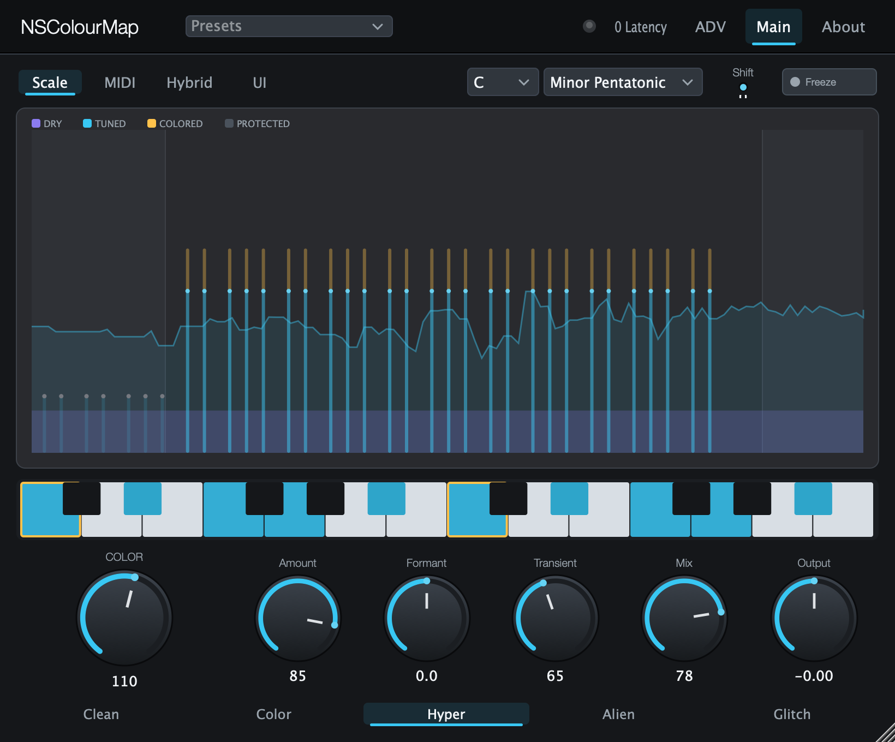
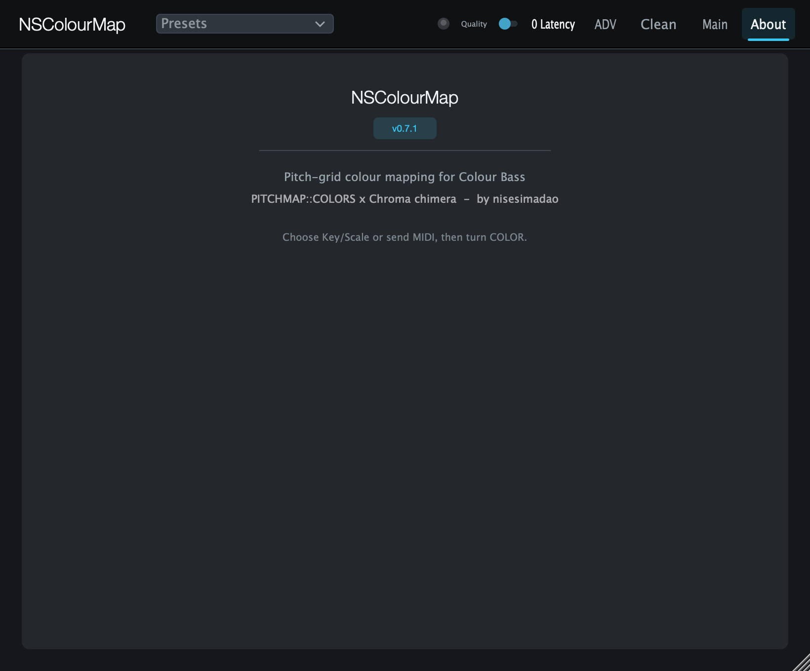

# NSColourMap

**Colour Bass 専用の、無料スペクトラル・カラー変換 VST3 / AU プラグイン（JUCE製）**

ベース・ノイズ・FM・ワブル・ボーカルチョップ・メタリック素材を、曲のキーや MIDI コードに合わせた**色彩豊かでキー感のあるハーモニック・テクスチャ**へ変換します。
**PITCHMAP::COLORS** の「ピッチグリッドに音を染める」感覚と、**Xynth Chroma** の「挿して Key/Scale を選んで COLOR を回すだけ」の手軽さを融合することを狙っています。

> ピッチ補正（Auto‑Tune 系）ではありません。スペクトラルな **カラー・マッパー** です。



---

## 使い方（クイックスタート）

1. 音作りしたいトラックに NSColourMap を挿す
2. **Key / Scale** を選ぶ（または Grid Mode を **MIDI** にして MIDI コードを送る）
3. **COLOR** を上げる
4. **Mode** と **Scale Shift** で色を動かす
5. **Mix** でなじませ、**Low Cut** で低域を守る

大きな **COLOR** ノブだけで音作りを始められます。その他は微調整用です。

UIはヘッダーの **Clean / Classic** ボタンで切り替えられます（初期値 Clean = SOURCE / CHARACTER / COLOR / TONE にセクション分けした分かりやすい表示。Classic = 従来表示）。各コントロールにはマウスオーバーで日本語の説明が出ます。

## 主なコントロール

| コントロール | 範囲 | 内容 |
|---|---|---|
| **Grid Mode** | Scale / MIDI / Hybrid / UI | ピッチグリッド（ターゲット音）の出どころ |
| **Character** | Clean / Color / Hyper / Alien / Glitch | 全体のキャラクター（同一DSPの5つのチューニング） |
| **COLOR** | 0–200% | メインマクロ。0–100%はドライ→染め、100–200%で共鳴・きらびやかなテイルを追加 |
| **Amount** | 0–100% | グリッドへ寄せる強さ |
| **Scale Shift** | −12…+12 半音 | グリッド全体を移動（オートメーション推奨） |
| **Formant** | −24…+24 半音 | 母音/サイズ感（疑似フォルマント） |
| **Gamma** | 0–100% | フォルマントの山谷を誇張し、ゆっくり母音を揺らす（有機的な動き） |
| **Transient** | 0–150% | アタックをドライのまま通す |
| **Morph** | 0–100% | ドライの輪郭/ダイナミクスをウェットに転写（トランジェント保持・テイル制御） |
| **Mix / Output** | — | ドライ/ウェット、出力 |
| **Key / Scale** | — | Scale モードのターゲット（12種、Whole Tone・Chromatic 含む） |
| **Freeze** | On/Off（初期Off） | Off:ノートを離すと止まる / On:最後のコードを保持 |
| **Quality** | 0 Latency / High Quality | 0 Latency=オシレーター核（遅延なし） / High Quality=STFTスペクトラル・スナップ（高音質・レイテンシあり） |
| **Advanced（ADV）** | — | Gamma・Morph・Gate・Low Cut・High Cut・Side Mute・Multirate |

## ビジュアライザー

中央の表示でカラーエンジンの動きが分かります。

- **DRY**（紫）— 原音のエネルギー
- **TUNED**（シアン）— ピッチグリッド上に染まった成分
- **COLORED**（アンバー）— COLOR 100%超で増える共鳴/テイル
- **PROTECTED**（グレー）— 処理対象外（Low Cut / High Cut の外。サブはモノでクリーンに保護）

## 音作りの設計思想（Colour Bass 向け）

- **低域はクリーンに保護**：Low Cut（〜100–120Hz）以下はモノ・無加工で素通し。色付けは中高域だけに適用
- **輝きは歪みでなく倍音で**：レゾネーターのオクターブ共鳴＋オシレーターのシマー（緩いLFOで揺れる）＋エア・シェルフで、2–8kHz/10–16kHz をきらめかせる
- **音割れ対策**：tanh のソフトサチュレーション、約6–8kHz の**ダイナミックなハーシュ抑制**、COLOR を上げても音量が暴れない**オートゲイン**
- **クリアさ**：Morph と Transient でアタックを保ち、Gate でテイルを締める

## MIDI ルーティング

NSColourMap は MIDI を**受信する**オーディオエフェクトです。ヘッダーの **MIDI LED** が点かない場合は MIDI が届いていないので、**Grid Mode → Scale**（MIDI不要）で使うか、ルーティングを見直してください。詳細は [`docs/Routing_Guide.md`](docs/Routing_Guide.md)。

効かないときは：1) MIDI LED 確認 → 2) MIDI Grid モード → 3) Freeze On → 4) まず Scale モード → 5) COLOR と Mix を上げる

---

## サンプル音声

トイレ/水流系FoleyをColour Bass素材として使い、NSColourMapでCmin7のグリッドへ寄せた例です。元音源はBigSoundBankのCC0サンプルを使用しています。各モードは同じ素材/コードでレンダーしているので、キャラクター差を聴き比べできます。

| Mode | Audio |
| --- | --- |
| Dry | [WAV](samples/toilet_flush_dry_cc0.wav)<br><audio controls src="samples/toilet_flush_dry_cc0.wav"></audio> |
| Clean | [WAV](samples/toilet_flush_clean_cmin7.wav)<br><audio controls src="samples/toilet_flush_clean_cmin7.wav"></audio> |
| Color | [WAV](samples/toilet_flush_color_cmin7.wav)<br><audio controls src="samples/toilet_flush_color_cmin7.wav"></audio> |
| Hyper | [WAV](samples/toilet_flush_hyper_cmin7.wav)<br><audio controls src="samples/toilet_flush_hyper_cmin7.wav"></audio> |
| Map | [WAV](samples/toilet_flush_map_cmin7.wav)<br><audio controls src="samples/toilet_flush_map_cmin7.wav"></audio> |
| Glitch | [WAV](samples/toilet_flush_glitch_cmin7.wav)<br><audio controls src="samples/toilet_flush_glitch_cmin7.wav"></audio> |

- Source: [BigSoundBank #0836 Urinal flush water](https://bigsoundbank.com/urinal-flush-water-s0836.html), CC0 / public domain equivalent.
- Process: preset `10 COLOR 150 Tail` base, MIDI Grid, held Cmin7 (`C Eb G Bb`), short 8 s excerpt.
- Re-render: `cmake --build build --target NSColourMap_RenderAudioSamples && ./build/NSColourMap_RenderAudioSamples`.

---

## ダウンロード

[Releases](https://github.com/nisesimadao/NSColourMap/releases) に macOS（VST3 / AU）・Windows（VST3）のビルドを置いています（タグ push 時に GitHub Actions が自動ビルド・添付）。

## ビルド

CMake ≥ 3.22 と C++17 コンパイラが必要です。JUCE 8.0.14 は自動取得されます。

```sh
cmake -S . -B build -DCMAKE_BUILD_TYPE=Release
cmake --build build --config Release
ctest --test-dir build        # 楽典 + DSP Smoke + 実プロセッサのフルチェーン確認
```

成果物：`build/NSColourMap_artefacts/Release/{VST3,AU}/`

## About



PITCHMAP::COLORS × Chroma を参考にした Colour Bass 用カラーマッパー（v0.5系）。STFT ピッチクラスマッパーは v2 予定。

## このプロジェクトについて

NSColourMap は **vibe coding（AIとの対話で要件・実装・調整を進めるスタイル）で作られたプロジェクト**です。

## ライセンス

MIT · by nisesimadao
