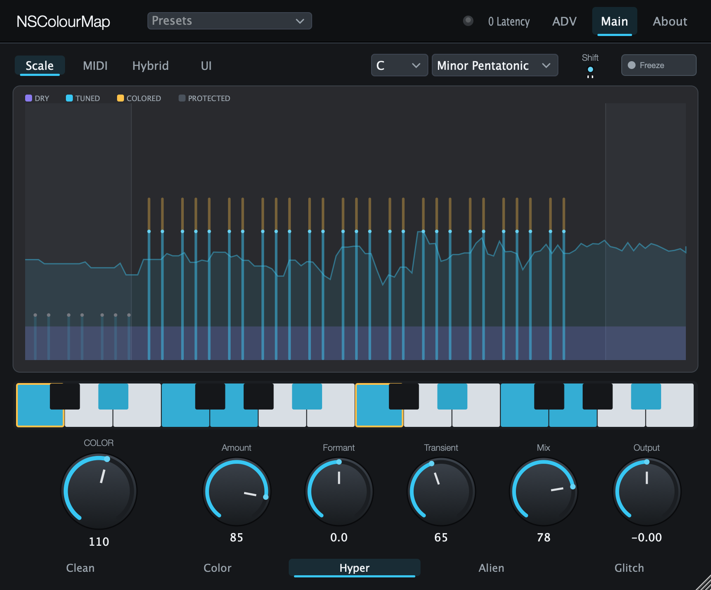
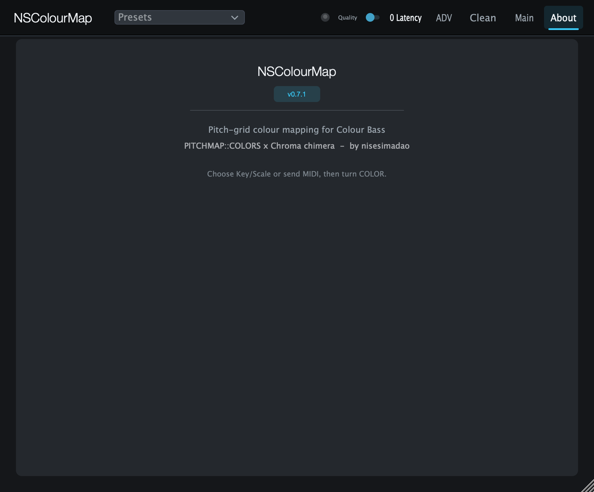

# NSColourMap

NSColourMap は、Colour Bass 制作向けの無料 VST3 / AU オーディオエフェクトです。
入力音を Key / Scale、MIDI コード、UI、または入力音から作ったピッチグリッドへ寄せ、倍音・共鳴・疑似フォルマントを加えてハーモニックなテクスチャへ変換します。

PITCHMAP::COLORS や Chroma のワークフローを参考にしていますが、UI、ブランド、内部実装を複製するものではありません。
DSP は NSColourMap 独自の実装です。

> Auto-Tune 系のピッチ補正ではありません。
> ピッチグリッドを使ってスペクトルと倍音構成を変えるエフェクトです。



## クイックスタート

初回起動時は日本語オンボーディングを表示します。
スキップした場合も **About → 使い方** から再表示できます。

1. 処理したいトラックへ NSColourMap を挿します。
2. **Key / Scale** を選ぶか、**Grid Mode → MIDI** にしてコード MIDI を送ります。
3. **COLOR** を調整して処理量と共鳴テイルを変えます。
4. **Character** と **Scale Shift** で音色とピッチグリッドを調整します。
5. **Mix** で原音との比率を決め、必要に応じて **Low Cut** で低域を処理対象から外します。

新規インスタンスはプリセット **10 COLOR 150 Tail** に近い初期値です。
UI は **Clean / Classic** で切り替えられます。
Clean は SOURCE / CHARACTER / COLOR / TONE に分けた表示、Classic は従来レイアウトです。

## 主なコントロール

| コントロール | 範囲 | 内容 |
|---|---|---|
| **Grid Mode** | Scale / MIDI / Hybrid / UI / Audio | ターゲットとなるピッチグリッドの生成元 |
| **Character** | Clean / Color / Hyper / Map / Glitch | 同じ DSP を異なる係数で動かす 5 つのプロファイル |
| **COLOR** | 0–200% | 0–100% で dry → tuned の比率を上げ、100–200% で共鳴・テイルを追加 |
| **Amount** | 0–100% | ピッチグリッドへ寄せる強さ |
| **Scale Shift** | −12…+12 半音 | グリッド全体の移調 |
| **Formant** | −24…+24 半音 | 疑似フォルマントの中心位置 |
| **Gamma** | 0–100% | フォルマント形状と低速モーフの深さ |
| **Transient** | 0–150% | 原音のアタックを戻す量 |
| **Morph** | 0–100% | dry の振幅輪郭を wet へ反映する量 |
| **Mix / Output** | — | dry / wet と出力レベル |
| **Key / Scale** | — | Scale mode のターゲット |
| **Freeze** | On / Off | MIDI note を離した後も最後のコードを保持するか |
| **Quality** | 0 Latency / Low / Mid / High | 処理方式と品質 / latency の選択 |
| **Advanced（ADV）** | — | Gamma / Morph / Gate / Low Cut / High Cut / Side Mute / Multirate |

## Character

| Character | 用途 |
|---|---|
| **Clean** | 原音の輪郭を残しながらピッチグリッド成分を加える |
| **Color** | 標準的なバランス |
| **Hyper** | COLOR 100% 以上で共鳴テイルと高域成分を強める |
| **Map** | ピッチグリッドへの寄せ方を強める |
| **Glitch** | レーザー、フィル、揺れるテイルなどの変化を大きくする |

## ビジュアライザー

中央表示は、処理中の成分を次の区分で示します。

- **DRY**（紫）：原音のエネルギー。
- **TUNED**（シアン）：ピッチグリッドへ寄せた成分。
- **COLORED**（アンバー）：COLOR 100% 以上で追加される共鳴 / テイル。
- **PROTECTED**（グレー）：Low Cut / High Cut の外側にあり、処理対象から外した成分。

## DSP の方針

- **ピッチグリッド**：Key / Scale、MIDI コード、UI、入力音検出からターゲット note set を作ります。
- **低域保護**：既定では Low Cut 110 Hz 以下を主な colour 処理から外します。
- **高域成分**：resonator、octave-up partial、air shelf を組み合わせます。
- **レベル制御**：soft saturation、high-band の動的抑制、energy matching を使います。
- **トランジェント保持**：Morph / Transient / Gate でアタックとテイルのバランスを調整します。

実装の詳細と測定条件は [`docs/DSP_Notes.md`](docs/DSP_Notes.md) を参照してください。

## MIDI ルーティング

NSColourMap は MIDI 入力を受け取れるオーディオエフェクトです。
MIDI LED が点灯しない場合は、MIDI がプラグインへ届いていません。
MIDI が不要な **Grid Mode → Scale** でも利用できます。

DAW ごとのルーティング例は [`docs/Routing_Guide.md`](docs/Routing_Guide.md) を参照してください。

## サンプル音声

CC0 の水流 Foley を Cmin7 の MIDI grid へ寄せた比較用サンプルです。
各 Character は同じ入力とコードを使ってレンダリングしています。

| Mode | Audio |
| --- | --- |
| Dry | [Play / Download WAV](https://raw.githubusercontent.com/nisesimadao/NSColourMap/main/samples/toilet_flush_dry_cc0.wav) |
| Clean | [Play / Download WAV](https://raw.githubusercontent.com/nisesimadao/NSColourMap/main/samples/toilet_flush_clean_cmin7.wav) |
| Color | [Play / Download WAV](https://raw.githubusercontent.com/nisesimadao/NSColourMap/main/samples/toilet_flush_color_cmin7.wav) |
| Hyper | [Play / Download WAV](https://raw.githubusercontent.com/nisesimadao/NSColourMap/main/samples/toilet_flush_hyper_cmin7.wav) |
| Map | [Play / Download WAV](https://raw.githubusercontent.com/nisesimadao/NSColourMap/main/samples/toilet_flush_map_cmin7.wav) |
| Glitch | [Play / Download WAV](https://raw.githubusercontent.com/nisesimadao/NSColourMap/main/samples/toilet_flush_glitch_cmin7.wav) |

- Source: [BigSoundBank #0836 Urinal flush water](https://bigsoundbank.com/urinal-flush-water-s0836.html), CC0 / public-domain equivalent.
- Process: preset `10 COLOR 150 Tail` base, MIDI Grid, held Cmin7 (`C Eb G Bb`), 8-second excerpt.
- Re-render: `cmake --build build --target NSColourMap_RenderAudioSamples && ./build/NSColourMap_RenderAudioSamples`.

## ダウンロード

[Releases](https://github.com/nisesimadao/NSColourMap/releases) で macOS（VST3 / AU）と Windows（VST3）のビルドを配布します。
タグ push 時に GitHub Actions がビルドして Release へ添付します。

## ビルド

CMake 3.22 以上と C++17 compiler が必要です。
JUCE 8.0.14 は configure 時に取得します。

```sh
cmake -S . -B build -DCMAKE_BUILD_TYPE=Release
cmake --build build --config Release
ctest --test-dir build
```

成果物：`build/NSColourMap_artefacts/Release/{VST3,AU}/`

## About



現在は Scale / MIDI / Hybrid / UI / Audio の grid mode、5 つの Character、STFT を使う High Quality mode、日本語オンボーディングを実装しています。

NSColourMap は、AI を含む対話型の開発支援を使いながら実装・調整したプロジェクトです。

## ライセンス

AGPL-3.0-or-later · by nisesimadao

JUCE 8 は AGPLv3 / 商用ライセンスのデュアルライセンスです。
この公開版は AGPLv3 側で配布します。
第三者素材については [THIRD_PARTY_NOTICES.md](THIRD_PARTY_NOTICES.md) を参照してください。
